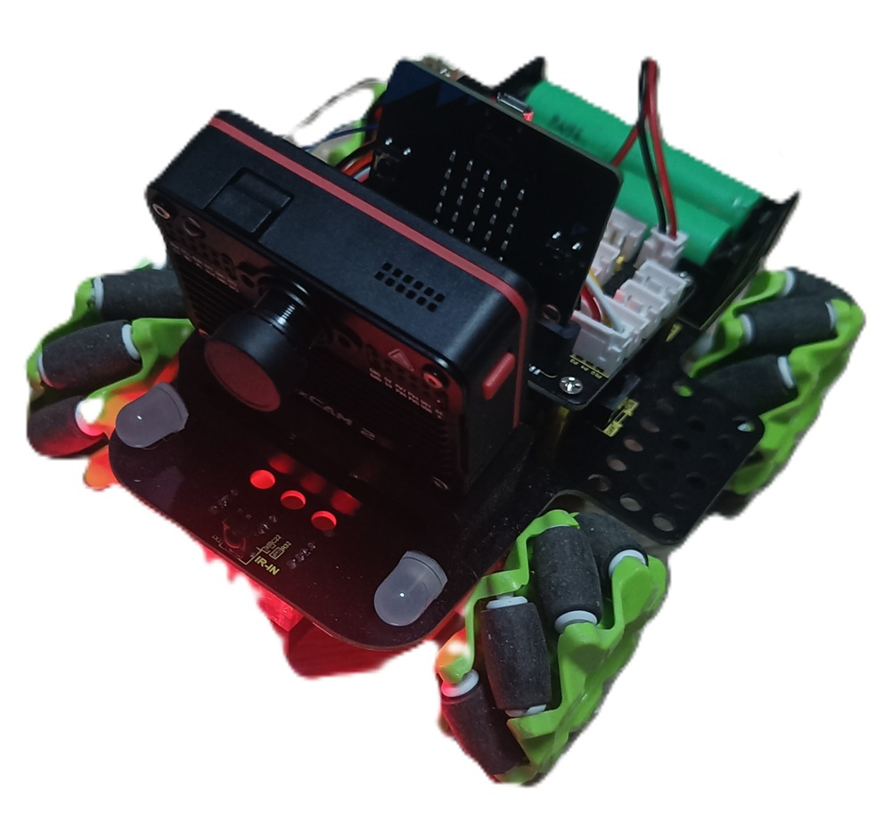
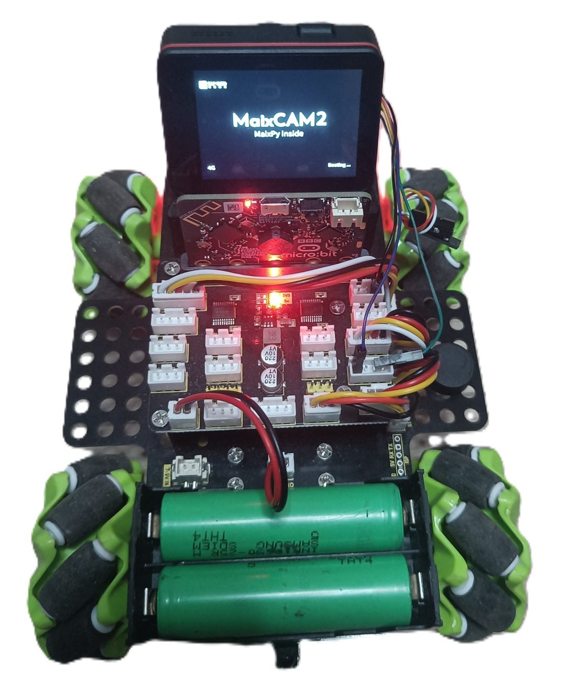
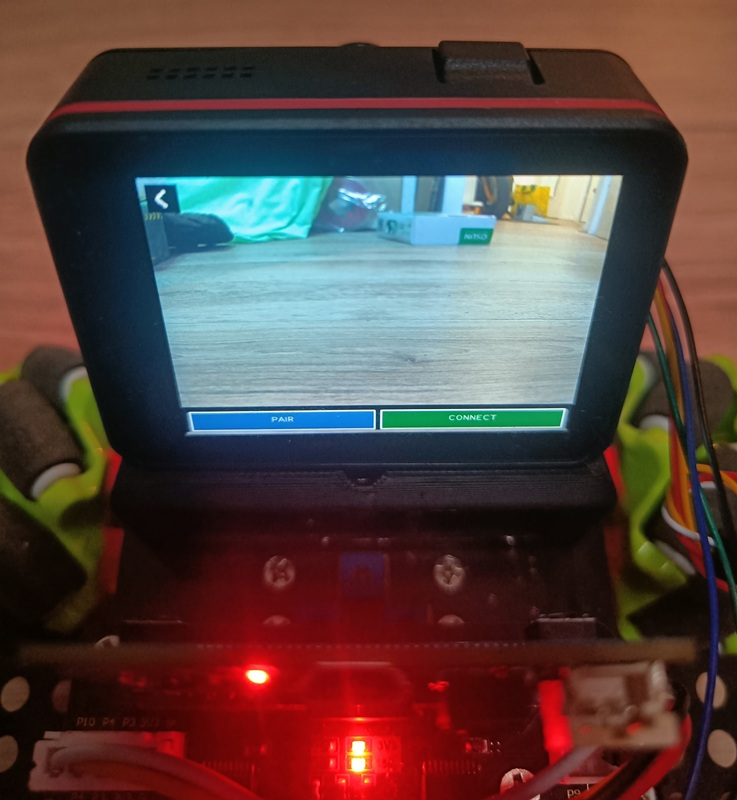
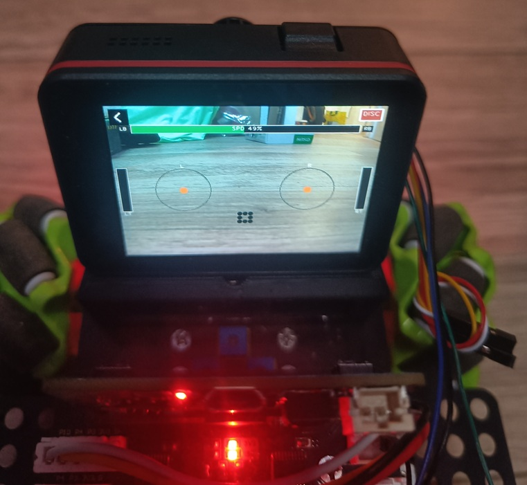

# Maixcam2 - Keyestudio Microbit 4WD Mecanum Rover

> 🇬🇧 English (default on GitHub) : [README.md](README.md)

<p align="center">
  <a href="resources/MaixCam2_Mecanum_Rover.jpg">
    
  </a>
</p>

<p align="center"><em>Cliquez sur l'image pour l'ouvrir en pleine résolution.</em></p>

Firmware PlatformIO (C++) pour piloter le **Keyestudio 4WD Mecanum Robot Car V2** (BBC micro:bit V2) via une liaison série binaire depuis un **MaixCam** (ou tout autre hôte UART).

## Architecture

```
MaixCam (UART TX/RX)  <--115200-->  micro:bit V2 (P1=TX, P2=RX)
                                           |
                                      I2C (SDA/SCL interne)
                                           |
                              Carte moteur Keyestudio (HR8833 x2)
                                           |
                              4 moteurs DC + roues mécanum
```

- **Upper** = roues avant (Upper Left / Upper Right)
- **Lower** = roues arrière (Lower Left / Lower Right)
- Les moteurs sont pilotés via I2C (`0x30`) comme dans l'exemple Python `keyes_mecanum_Car_V2.py`
- Canaux PWM I2C 1-8 → drivers HR8833 (2 ponts par moteur)

### Mapping moteurs (I2C `0x30`)

| Moteur | Canaux PWM | Description |
|--------|------------|-------------|
| Upper Right | 1, 2 | Avant droite |
| Upper Left | 3, 4 | Avant gauche |
| Lower Right | 5, 6 | Arrière droite |
| Lower Left | 7, 8 | Arrière gauche |

## Projet PlatformIO

Le firmware se trouve dans `microbit/` :

```bash
cd microbit
pio run -t upload
```

- Board : `bbcmicrobit_v2`
- Framework : Arduino (nRF52)
- Upload : **mbed** (copie du `.hex` sur le lecteur `MICROBIT`)

### Flasher le micro:bit (Windows)

**Important :** la programmation se fait via le **port USB du micro:bit** (en haut de la carte),
pas via la liaison serie P1/P2 vers le MaixCam.

1. Brancher un cable USB **donnees** (pas charge seule) sur le micro:bit
2. Verifier dans l'Explorateur Windows qu'un lecteur **`MICROBIT`** apparait
3. Lancer `pio run -t upload` depuis le dossier `microbit/`
4. Le firmware est copie automatiquement ; la carte redemarre

Si PlatformIO ne trouve pas le lecteur automatiquement, indiquer sa lettre :

```bash
pio run -t upload --upload-port D:
```

(remplacer `D:` par la lettre du lecteur `MICROBIT` dans l'Explorateur)

#### Que voir dans le Gestionnaire de peripheriques ?

| Element | Normal ? | Role |
|---------|----------|------|
| Lecteur `MICROBIT` dans l'Explorateur | **Oui, indispensable** | Flash du firmware (methode mbed) |
| `DAPLink CMSIS-DAP` / `mbed` sous USB | Souvent oui | Debug / flash alternatif |
| 1 ou 2 ports COM (`mbed Serial Port`) | Souvent oui | Console USB (pas utilise par ce projet) |
| Rien du tout | **Non** | Cable, port USB ou carte non alimentee |

**Pas besoin d'installer un driver** sur Windows 10/11 dans la plupart des cas.
Si rien n'apparait : essayer un autre cable USB, un autre port, ou appuyer sur le bouton **RESET** du micro:bit.

#### Lecteur `MAINTENANCE` au lieu de `MICROBIT`

La carte est en mode maintenance DAPLink. Debrancher/rebrancher ou glisser un firmware `.hex` dedans pour revenir en mode normal.

#### Methode alternative (cmsis-dap)

Si le DAPLink est bien detecte :

```bash
pio run -e nrf52_dk_cmsis -t upload
```

#### Flash manuel (sans PlatformIO)

```bash
pio run
```

Puis copier `.pio/build/nrf52_dk/firmware.hex` sur le lecteur `MICROBIT`.

Oui, avec PlatformIO on code en **C++** (pas en MicroPython/MakeCode).

## Liaison série

| Paramètre | Valeur |
|-----------|--------|
| Broches | **P1 = TX**, **P2 = RX** (connecteur edge) |
| USB | Port COM **mbed** (console USB du micro:bit) |
| Baudrate | **115200** |
| Format | 8N1 |

Le firmware accepte le **même protocole binaire** sur les deux interfaces :
- **P1/P2** : liaison vers le MaixCam monte sur le robot
- **USB COM** : test depuis un PC via le port **mbed Serial** (pas le port DAPLink)

Le micro:bit expose souvent **2 ports COM** sous Windows :
| Port | Usage |
|------|-------|
| **mbed Serial Port (COMx)** | Protocole rover + logs debug |
| **DAPLink CMSIS-DAP (COMy)** | Debug/upload uniquement — **ne pas utiliser** pour le protocole |

Au démarrage, le firmware :
1. Initialise les moteurs (tout à 0)
2. Écoute les trames binaires sur P1/P2 **et** sur le port COM USB mbed
3. Écrit les logs debug sur le port USB mbed (`[rover] ready ...`)

## Protocole binaire

### Trame prédéfinie (4 octets)

Mouvements courants en une seule commande :

```
[0xAA] [CMD] [SPEED] [CHECKSUM]
```

- `SPEED` : 0-255 (vitesse PWM moteur)
- `CHECKSUM` = `(0xAA + CMD + SPEED) & 0xFF`

| CMD | Nom | Mouvement |
|-----|-----|-----------|
| `0x00` | STOP | Arrêt immédiat |
| `0x01` | FORWARD | Tout en avant |
| `0x02` | BACKWARD | Tout en arrière |
| `0x03` | STRAFE_LEFT | Déplacement latéral gauche |
| `0x04` | STRAFE_RIGHT | Déplacement latéral droit |
| `0x05` | DIAG_FL | Diagonale avant-gauche |
| `0x06` | DIAG_FR | Diagonale avant-droite |
| `0x07` | DIAG_BL | Diagonale arrière-gauche |
| `0x08` | DIAG_BR | Diagonale arrière-droite |
| `0x09` | SPIN_LEFT | Rotation sur place (sens anti-horaire) |
| `0x0A` | SPIN_RIGHT | Rotation sur place (sens horaire) |
| `0x0B` | PIVOT_RIGHT | Pivot autour du côté droit |
| `0x0C` | PIVOT_REAR | Pivot autour de l'axe arrière |
| `0x30` | JOYSTICK | Axes analogiques strafe / forward / spin / pivot |

Documentation détaillée : **[microbit/PROTOCOL.md](microbit/PROTOCOL.md)** (index FR/EN)

### Trame RAW mécanum (5 octets)

Tout mouvement mécanum possible en une seule trame :

```
[0xAA] [0x20] [WHEEL_DIRS] [SPEED] [CHECKSUM]
```

- `CHECKSUM` = `(0xAA + 0x20 + WHEEL_DIRS + SPEED) & 0xFF`
- `WHEEL_DIRS` : 2 bits par roue (UL, UR, LL, LR)

| Bits | Roue |
|------|------|
| 0-1 | Upper Left |
| 2-3 | Upper Right |
| 4-5 | Lower Left |
| 6-7 | Lower Right |

| Valeur | Direction |
|--------|-----------|
| `00` | Stop |
| `01` | Avant |
| `10` | Arrière |
| `11` | Réservé (traité comme stop) |

### Trame joystick analogique (12 octets)

Voir **[microbit/PROTOCOL_FR.md](microbit/PROTOCOL_FR.md)** pour le détail complet (4 axes, mixer mécanum, checksum, exemples).

### Exemples

| Action | Trame hex (speed=100) |
|--------|----------------------|
| Avancer | `AA 01 64 0F` |
| Arrêter | `AA 00 00 AA` |
| Strafe droite | `AA 04 64 12` |
| Rotation horaire | `AA 0A 64 18` |
| RAW: avant (4 roues) | `AA 20 55 64 83` |

(`0x55` = `01010101` → les 4 roues en avant)

### Accusé de réception

Après une commande valide, le micro:bit renvoie 2 octets :

```
[0x55] [CMD]
```

## Structure du code

```
microbit/src/
  main.cpp                    # Wiring global setup/loop
  CommandAction.h             # Entree de table commande -> fonction
  CommandDispatcher.h/cpp     # Dispatch des commandes nommees
  MecanumJoystickMapper.h/cpp # Mapping joystick analogique -> roues
  MotorDriver.h/cpp           # Pilote I2C HR8833 + mouvements mécanum
  Protocol.h                  # Constantes du protocole
  ProtocolParser.h            # Parser binaire
  SerialRover.h/cpp           # UART P1/P2 (UARTE1)
```

## Test depuis le PC (menu interactif)

Script PowerShell (cree le venv, installe pyserial, lance le menu) :

```powershell
cd tools
.\run_test_rover.ps1
.\run_test_rover.ps1 -Port COM12 -Speed 80
```

Ou manuellement :

```bash
pip install -r tools/requirements.txt
python tools/test_rover_menu.py
python tools/test_rover_menu.py -p COM12 -s 80
```

**Via USB mbed** : brancher le micro:bit en USB, utiliser le port COM mbed dans `-p` (ex. `COM3`).

**Via P1/P2** : adaptateur USB-serie ou MaixCam relie a P1/P2.

## Test depuis MaixCam (UI tactile)

Copier `maixcam/maixcam_test_rover.py` sur le MaixCam et lancer depuis MaixPy.

- Ecran 640x480 avec boutons pour chaque mouvement
- Bouton retour (envoie STOP puis quitte)
- Boutons vitesse + / -
- UART maixcam2 : A21(TX) / A22(RX) vers micro:bit P2/P1

### Debug USB (logs)

Le firmware ecrit des logs texte sur le port COM USB mbed :

```bash
cd microbit
pio device monitor -p COM9
```

Au boot : `[rover] ready (usb+p1p2, 115200)`

A chaque commande recue :
`[rover] p1p2 cmd=0x01 spd=100` ou `[rover] usb cmd=0x01 spd=100`

Si rien n'apparait dans le monitor quand le MaixCam envoie, verifier le cablage P1/P2.
Si les logs apparaissent mais les moteurs ne bougent pas, probleme I2C/moteur.

Re-flasher apres modification firmware :

```bash
cd microbit
pio run -t upload
```

## Pilotage Xbox / Bluetooth

Le micro:bit V2 n'est pas une bonne cible pour gérer directement une manette Xbox BLE :
le framework Arduino nRF52 utilisé ici est minimal, et l'ajout d'une pile HID/BLE complète rendrait
le firmware moteur difficile à maintenir.

Architecture recommandée :

```
Manette Xbox BLE -> MaixCam2 (Linux evdev + BlueZ) -> UART protocole rover -> micro:bit -> moteurs
```

Le micro:bit reste concentré sur son rôle stable : parser le protocole série et piloter les moteurs.

Application complète : **`maixcam/roverMecanum/`** — voir [README_FR.md](maixcam/roverMecanum/README_FR.md).

## Pilotage depuis MaixCam (Python)

```python
import serial

PORT = "/dev/ttyUSB0"  # adapter selon l'OS
BAUD = 115200

def checksum(cmd, speed):
    return (0xAA + cmd + speed) & 0xFF

def send_move(ser, cmd, speed=100):
    ser.write(bytes([0xAA, cmd, speed, checksum(cmd, speed)]))

def send_stop(ser):
    send_move(ser, 0x00, 0x00)

with serial.Serial(PORT, BAUD, timeout=1) as ser:
    send_move(ser, 0x01, 100)   # avancer
    ack = ser.read(2)           # b'\x55\x01'
    send_stop(ser)
```

## Photos

Cliquez sur une vignette pour agrandir l'image.

<p align="center">
  <a href="resources/MaixCam2_Mecanum_Rover2.jpg"></a>
  &nbsp;
  <a href="resources/MaixCam2_Mecanum_Rover3.jpg"></a>
  &nbsp;
  <a href="resources/MaixCam2_Mecanum_Rover4.jpg"></a>
</p>

| | | |
|:---:|:---:|:---:|
| **Vue du dessus** — démarrage MaixPy sur MaixCam2 | **Appairage** — connexion manette Xbox en BLE | **Pilotage** — vidéo live + jauges sticks + vitesse |

## Références

- Exemples Python Keyestudio dans `examples/`
- `examples/LiaisonSerie.txt` : commandes texte d'origine (remplacées ici par le protocole binaire)
